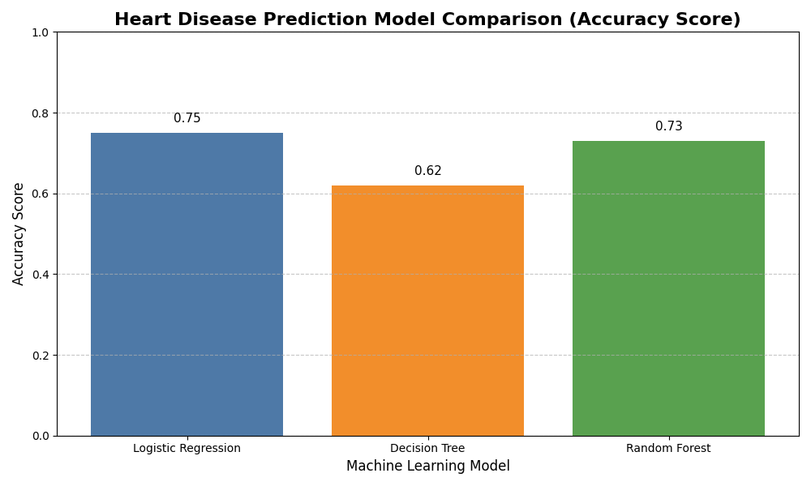

# ❤️ Heart Disease Diagnostic Prediction



## 📌 Project Overview
This repository contains a comprehensive data mining project focused on predicting heart disease presence using clinical and demographic patient data. By leveraging multiple machine learning techniques, we identified key health indicators and built high-accuracy predictive models.

## 🚀 Key Highlights
- **Consensus Feature Selection:** Integrated 4 different selection methods (Correlation, RFE, Lasso, and Tree Importance) to identify the 9 most critical health predictors.
- **Robust Preprocessing:** Handled outliers, implemented feature scaling, and performed categorical encoding for optimal model performance.
- **Model Performance:** Logistic Regression and Random Forest both achieved strong cross-validated results (~80%).

## 📂 Project Structure
```text
my_project1/
├── Dataset/
│   ├── heart.csv           # Primary clinical dataset
│   └── o2Saturation.csv    # Supplementary data
├── step2.ipynb             # Exploratory Data Analysis (EDA)
├── step3.ipynb             # Data Preprocessing & Cleaning
├── step4.ipynb             # Feature Selection & Predictive Modeling
└── README.md
```

## 🛠️ Workflow Steps

### 🔍 Step 1: Exploratory Data Analysis
- Visualized distributions of age, cholesterol, and heart rate.
- Analyzed correlations between clinical features and heart disease presence.
- Identified significant patterns through heatmaps and violin plots.

### 🧹 Step 2: Data Preprocessing
- **Outlier Removal:** Used Z-score filtering to eliminate statistical noise.
- **Encoding:** Applied One-Hot Encoding to categorical variables (chest pain type, ECG results, etc.).
- **Scaling:** Standardized numerical features for model consistency.

### 🤖 Step 3: Modeling & Evaluation
- Evaluated three primary models: **Logistic Regression, Decision Trees, and Random Forest**.
- Implemented cross-validation to ensure model reliability.
- **Top Predictors Identified:** Thalassemia type, maximum heart rate achieved, and patient age.

## 📊 Performance Comparison
| Model | Test Accuracy | Cross-Val Accuracy |
| :--- | :--- | :--- |
| **Logistic Regression** | **75%** | **80% ± 0.03** |
| Random Forest | 73% | 80% ± 0.05 |
| Decision Tree | 62% | 73% ± 0.04 |

## ⚙️ Setup & Installation
1. **Clone the repository:**
   ```bash
   git clone https://github.com/your-username/heart-disease-prediction.git
   cd heart-disease-prediction
   ```
2. **Install dependencies:**
   ```bash
   pip install pandas numpy matplotlib seaborn scikit-learn scipy
   ```
3. **Run the analysis:**
   Open and run the notebooks in order: `step2.ipynb` ➔ `step3.ipynb` ➔ `step4.ipynb`.

## 📈 Future Improvements
- Implement Gradient Boosting models (XGBoost/LightGBM).
- Perform hyperparameter tuning via GridSearch.
- Develop a web interface for real-time risk assessment.

---
*Created as part of a Data Mining study.*
